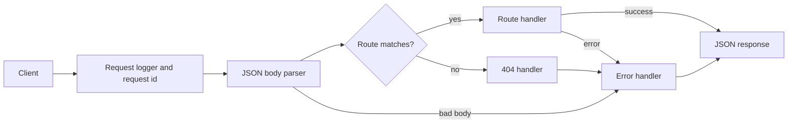

# Architecture

This document describes how PayWhenDone is put together **today**. It is updated every phase.

**Current state (Phase 2):** a backend API skeleton with configuration, logging, error handling and tests. There is no database, authentication or payment logic yet.

## Repository layout

```text
apps/api/
  src/
    server.ts            Starts the HTTP server (the only file that opens a port)
    app.ts               Builds the Express app: middleware and routes
    config.ts            Reads and validates environment variables
    logger.ts            Creates the structured logger
    errors.ts            Error classes we expect and can describe to clients
    middleware/          Code that runs on every request (404, error handler)
    routes/              One file per group of endpoints
  test/                  Automated tests
```

## Request lifecycle

Every request passes through the same chain, in order.



Think of it as airport security: each step inspects the passenger, and anything suspicious is sent to one central desk (the error handler) that handles it the same way every time.

## Key design rules

- **`app.ts` and `server.ts` are separate.** Tests use the app directly and never open a network port.
- **Dependencies are passed in, not grabbed from global state.** `createApp({ logger })` receives its logger. This makes the code easy to test and to change.
- **Fail fast.** Invalid configuration stops the process at startup with a readable message, instead of causing strange behavior later.
- **One error format.** Every error response has the same JSON shape (see [API.md](API.md)).
- **Never leak internals.** Unexpected errors are logged in full for us, but the client only sees a generic message and a request id.
- **Never log secrets.** The logger redacts the `Authorization` and `Cookie` headers.

## Configuration

Settings come from environment variables and are validated with Zod in `config.ts`.

- `NODE_ENV`: `development`, `test` or `production` (default `development`)
- `PORT`: 1 to 65535 (default `3000`)
- `LOG_LEVEL`: `fatal`, `error`, `warn`, `info`, `debug`, `trace` or `silent` (default `info`)

In development, values are read from `apps/api/.env`, which is never committed. `apps/api/.env.example` lists every setting.

## Logging

Logs are structured JSON, one object per event, so tools can search and filter them. In development they are printed in a readable, colored format. Each request gets a unique id that appears in its log lines, in the `X-Request-Id` response header and in error responses.

## Testing

Tests use Vitest and Supertest. Supertest sends requests directly to the app in memory. The error handler is also tested in isolation with routes that deliberately fail.

## What comes next

Phase 3 adds PostgreSQL, so `/health` will be joined by a readiness check that confirms the database is reachable.